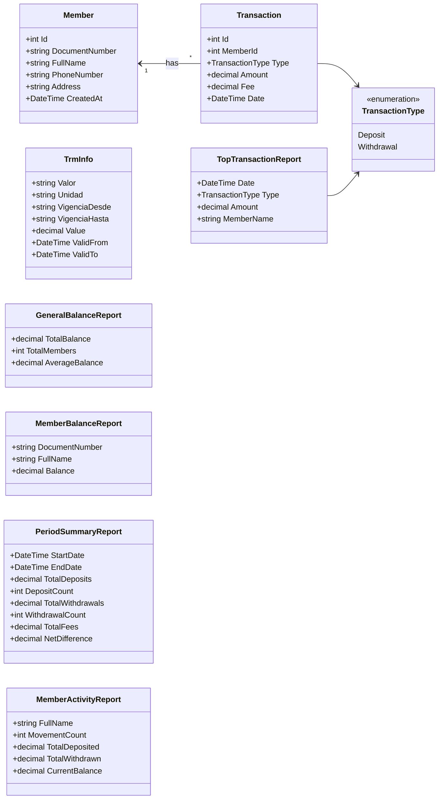

# Cooperativa Financiera El Progreso

Console management application for cooperative savings accounts, developed in .NET 10. It allows cashiers to register members, process deposits and withdrawals, consult balances in COP and USD (official TRM), and generate management reports.

## Technologies Used

- .NET 10 (C#)
- LINQ (Language Integrated Query)
- System.Text.Json (JSON simulated database persistence)
- HttpClient (Asynchronous consumption of the official TRM REST API from datos.gov.co)

## Layered Architecture

The project follows a layered architecture pattern:

- **Models**: Domain entities and data transfer objects (`Member`, `Transaction`, `TransactionType`, `TrmInfo`, and report models: `GeneralBalanceReport`, `MemberBalanceReport`, `PeriodSummaryReport`, `TopTransactionReport`, `MemberActivityReport`).
- **Repositories**: Data access layer responsible for reading and writing data to local JSON files (`IMemberRepository`, `ITransactionRepository`).
- **Services**: Business logic, validations, balance calculations, currency conversion, and analytical queries (`IMemberService`, `ITransactionService`, `ITrmService`, `IReportService`).
- **Views**: Presentation layer handling console user input and output formatting (`MemberView`, `TransactionView`, `ReportView`).

## Application Services

1. **MemberService (`IMemberService`)**
   - `RegisterMember`: Registers a new member ensuring document uniqueness.
   - `GetAllMembers`: Lists all members sorted alphabetically.
   - `FindByDocument`: Retrieves a member by exact document number.
   - `FindByName`: Searches members by partial name (case-insensitive).
   - `UpdateMember`: Updates member profile (name, phone, address).
   - `DeleteMember`: Removes a member only if they have no transaction history and zero balance.
   - `GetBalance`: Calculates member balance dynamically from transactions.

2. **TransactionService (`ITransactionService`)**
   - `Deposit`: Registers deposits with amounts greater than zero.
   - `Withdraw`: Registers withdrawals, applying an 8,000 COP fee when the amount exceeds 1,000,000 COP, and prevents overdrafts.
   - `GetMemberTransactions`: Retrieves the full chronological movement history of a member.

3. **TrmService (`ITrmService`)**
   - `GetCurrentTrmAsync`: Asynchronously consumes the official exchange rate API from `datos.gov.co` and displays the rate validity period without crashing if the network fails.

4. **ReportService (`IReportService`)**
   - `GetGeneralBalance`: Cooperative total balance, total members, and average balance.
   - `GetTop5MembersByBalance`: Top 5 members with the highest savings balance.
   - `GetInactiveMembers`: Members with zero recorded transactions.
   - `GetPeriodSummary`: Total deposits, withdrawals, fees, and net difference in a custom date range.
   - `GetTop10Transactions`: 10 largest transactions executed in the cooperative.
   - `GetCashFlowSummaryByMember`: Cash flow summary per member ordered by movement count.

## Class Diagrams

### 1. Domain Models & DTOs Diagram



### 2. Architecture Diagram (Services & Repositories)

```mermaid
classDiagram
    direction TB

    %% Repositories
    class IMemberRepository {
        <<interface>>
        +GetAll() List~Member~
        +GetById(int id) Member
        +Add(Member member) void
        +Update(Member member) void
        +Delete(int id) void
        +GetNextId() int
    }

    class ITransactionRepository {
        <<interface>>
        +GetAll() List~Transaction~
        +GetByMemberId(int memberId) List~Transaction~
        +Add(Transaction transaction) void
        +GetNextId() int
    }

    class MemberRepository {
        -string _filePath
    }

    class TransactionRepository {
        -string _filePath
    }

    MemberRepository ..|> IMemberRepository
    TransactionRepository ..|> ITransactionRepository

    %% Services
    class IMemberService {
        <<interface>>
        +RegisterMember(...) Member
        +GetAllMembers() List~Member~
        +FindByDocument(string doc) Member
        +FindByName(string name) List~Member~
        +UpdateMember(...) Member
        +DeleteMember(string doc) void
        +GetBalance(int memberId) decimal
    }

    class ITransactionService {
        <<interface>>
        +Deposit(string doc, decimal amount) Transaction
        +Withdraw(string doc, decimal amount) Transaction
        +GetMemberTransactions(string doc) List~Transaction~
    }

    class ITrmService {
        <<interface>>
        +GetCurrentTrmAsync() Task~TrmInfo~
    }

    class IReportService {
        <<interface>>
        +GetGeneralBalance() GeneralBalanceReport
        +GetTop5MembersByBalance() List~MemberBalanceReport~
        +GetInactiveMembers() List~Member~
        +GetPeriodSummary(DateTime start, DateTime end) PeriodSummaryReport
        +GetTop10Transactions() List~TopTransactionReport~
        +GetCashFlowSummaryByMember() List~MemberActivityReport~
    }

    class MemberService {
        -IMemberRepository _memberRepo
        -ITransactionRepository _txRepo
    }

    class TransactionService {
        -IMemberRepository _memberRepo
        -ITransactionRepository _txRepo
        -IMemberService _memberService
    }

    class TrmService {
        -HttpClient _httpClient
    }

    class ReportService {
        -IMemberRepository _memberRepo
        -ITransactionRepository _txRepo
        -IMemberService _memberService
    }

    MemberService ..|> IMemberService
    TransactionService ..|> ITransactionService
    TrmService ..|> ITrmService
    ReportService ..|> IReportService

    %% Dependencies
    MemberService --> IMemberRepository
    MemberService --> ITransactionRepository
    TransactionService --> IMemberRepository
    TransactionService --> ITransactionRepository
    TransactionService --> IMemberService
    ReportService --> IMemberRepository
    ReportService --> ITransactionRepository
    ReportService --> IMemberService
```



## How to Run

1. Open a terminal in the project folder:
   ```bash
   cd "Cooperativa Financiera El Progreso/Cooperativa Financiera El Progreso"
   ```
2. Build the application:
   ```bash
   dotnet build
   ```
3. Run the application:
   ```bash
   dotnet run
   ```
